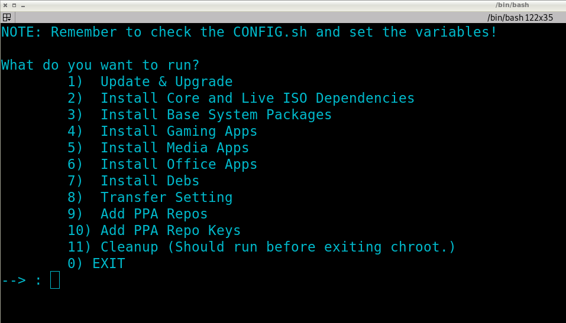

# Distro Builder
This is a powerful and easy way to build ubuntu/debian remix distributions with
debootstrap, chroot, and Xephyr at its core. These scripts handle everything
up to chroot and after while leaving the fun and meaty parts of the build to
be handled by the user.

# Notes
* Check the CONFIG.sh files for important variables that need to be set. (In COPY_OVER_TO_CHROOT/ and App Root dir)
* In COPY_OVER_TO_CHROOT/ Checkout the start.sh file for structuring your custom build pipeline through scripts.

# Updates
n/a

# TODO
* Create extremely bare bones install pipeline for core dependencies accross all build types.

# Images

