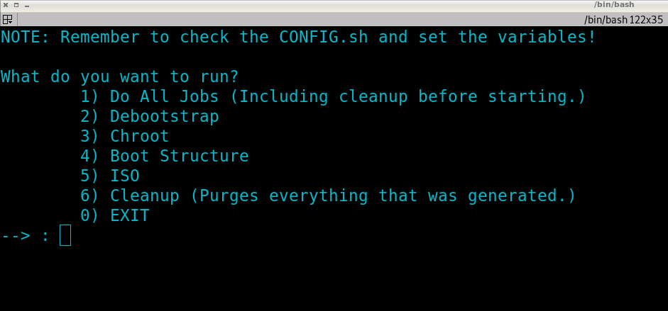

# Distro Builder
This is a powerful and easy way to build ubuntu remix distributions with
debootstrap, chroot, and Xephyr at its core. These scripts handle everything
up to chroot and after while leaving the fun and meaty parts of the build to
be handled by the user.

# Notes
Check the CONFIG.sh file for important variables that need to be set.

# Updates
n/a

# TODO
* Create Chroot script pipline again.

# Images

